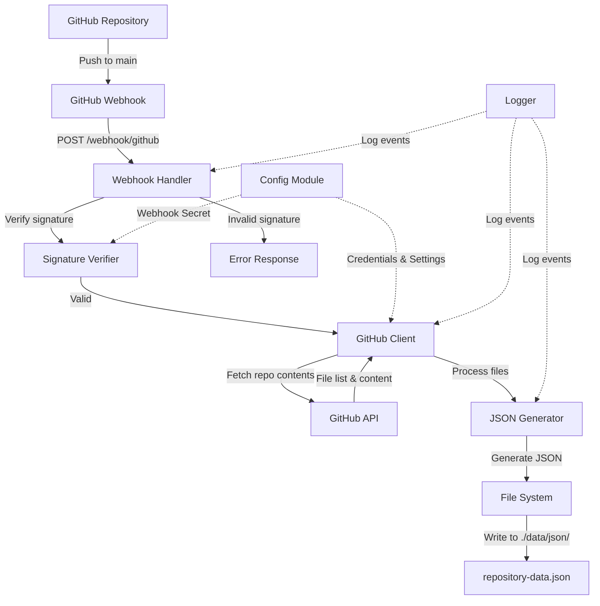

# GitHub Repository Sync Architecture

## Overview

This system fetches markdown files from a private GitHub repository on each
push to the main branch and generates a JSON file containing information about
all files in the repository.

## Architecture Diagram



## Components

### 1. Webhook Handler (`Api.Webhook`)
- **Route:** `POST /webhook/github`
- **Responsibilities:**
  - Receive GitHub webhook payloads
  - Extract event type and payload
  - Delegate to appropriate handlers
  - Return appropriate HTTP responses

### 2. Signature Verifier (`Security.GitHub`)
- **Purpose:** Verify webhook authenticity
- **Method:** HMAC-SHA256 signature verification
- **Input:** Request body, signature header, webhook secret

### 3. GitHub Client (`Client.GitHub`)
- **Responsibilities:**
  - Authenticate with GitHub API using Personal Access Token
  - Fetch repository contents recursively
  - Handle rate limiting and retries
  - Parse API responses

### 4. JSON Generator (`Generator.Repository`)
- **Input:** List of files from GitHub
- **Output:** Structured JSON with file metadata
- **Format:**
```json
{
  "repository": {
    "name": "repo-name",
    "owner": "owner-name",
    "updated_at": "2025-01-16T18:00:00Z"
  },
  "files": [
    {
      "path": "folder/file.md",
      "name": "file.md",
      "size": 1234,
      "sha": "abc123...",
      "type": "file",
      "last_modified": "2025-01-16T17:00:00Z"
    }
  ],
  "total_files": 42,
  "generated_at": "2025-01-16T18:15:00Z"
}
```

### 5. Configuration Module (`Core.Config`)
- **Environment Variables:**
  - `GITHUB_TOKEN`: Personal Access Token
  - `GITHUB_WEBHOOK_SECRET`: Webhook signature secret
  - `GITHUB_REPO_OWNER`: Repository owner
  - `GITHUB_REPO_NAME`: Repository name
  - `JSON_OUTPUT_PATH`: Output directory (default: `./data/json/`)

### 6. File System Module (`Utils.FileSystem`)
- **Responsibilities:**
  - Ensure output directory exists
  - Write JSON atomically (write to temp, then rename)
  - Handle file permissions

### 7. Logger (`Utils.Logger`)
- **Log Levels:** Debug, Info, Warning, Error
- **Output:** Console and/or file
- **Format:** Timestamp, level, component, message

## Data Flow

1. **GitHub Push Event** → GitHub sends webhook POST request
2. **Webhook Receipt** → Scotty handler receives request at `/webhook/github`
3. **Signature Verification** → Verify `X-Hub-Signature-256` header
4. **Event Processing** → Check if event is "push" to main branch
5. **Repository Fetch** → Use GitHub API to get repository tree
6. **JSON Generation** → Transform file list to structured JSON
7. **File Storage** → Write JSON to `./data/json/repository-data.json`

## Security Considerations

1. **Webhook Secret:** Store securely, never commit to repository
2. **Personal Access Token:** Use minimal required permissions (repo:read)
3. **HTTPS Only:** Ensure webhook endpoint uses HTTPS
4. **Request Validation:** Verify Content-Type and payload structure
5. **Rate Limiting:** Implement to prevent abuse

## Error Handling

1. **Invalid Signature:** Return 401 Unauthorized
2. **GitHub API Errors:** Log and return 502 Bad Gateway
3. **File System Errors:** Log and return 500 Internal Server Error
4. **Malformed Payload:** Return 400 Bad Request

## Dependencies to Add

```yaml
# package.yaml additions
dependencies:
  - aeson >= 2.0          # JSON parsing/generation
  - http-client >= 0.7    # HTTP requests
  - http-client-tls       # HTTPS support
  - github >= 0.29        # GitHub API client
  - cryptonite >= 0.30    # Cryptographic operations
  - bytestring            # Byte string operations
  - text                  # Text processing
  - time                  # Timestamps
  - directory             # File system operations
  - filepath              # Path manipulation
  - mtl                   # Monad transformers
  - exceptions            # Exception handling
  - fast-logger           # Logging
```

## Module Structure

```
backend/src/
├── Main.hs                 # Application entry point
├── Api/
│   ├── Router.hs          # Route definitions
│   └── Webhook.hs         # Webhook handlers
├── Client/
│   └── GitHub.hs          # GitHub API client
├── Core/
│   ├── Config.hs          # Configuration management
│   └── Types.hs           # Shared type definitions
├── Generator/
│   └── Repository.hs      # JSON generation logic
├── Security/
│   └── GitHub.hs          # Webhook signature verification
└── Utils/
    ├── FileSystem.hs      # File operations
    └── Logger.hs          # Logging utilities
```

## Testing Strategy

1. **Unit Tests:**
   - Signature verification
   - JSON generation
   - Configuration parsing

2. **Integration Tests:**
   - Mock GitHub API responses
   - File system operations
   - End-to-end webhook processing

3. **Manual Testing:**
   - Use ngrok for local webhook testing
   - GitHub webhook test delivery feature
   - Verify JSON output format

## Deployment Considerations

1. **Environment Setup:**
   - Set all required environment variables
   - Ensure write permissions for output directory
   - Configure reverse proxy (nginx) for HTTPS

2. **Monitoring:**
   - Log webhook events
   - Monitor GitHub API rate limits
   - Track sync failures

3. **Backup:**
   - Consider backing up generated JSON files
   - Log retention policy
